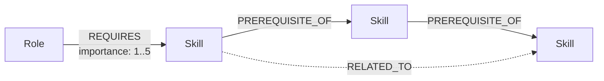
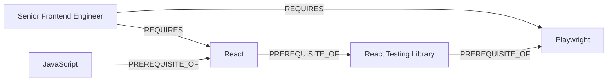
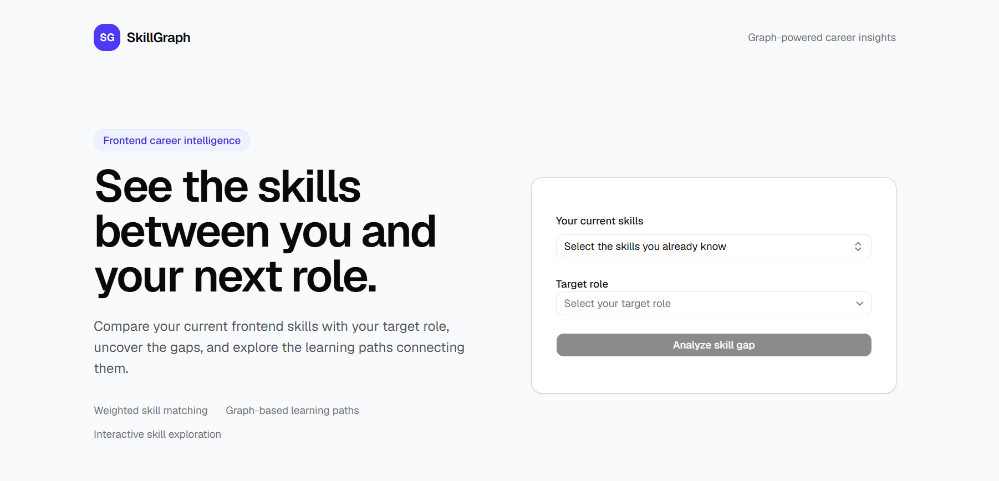
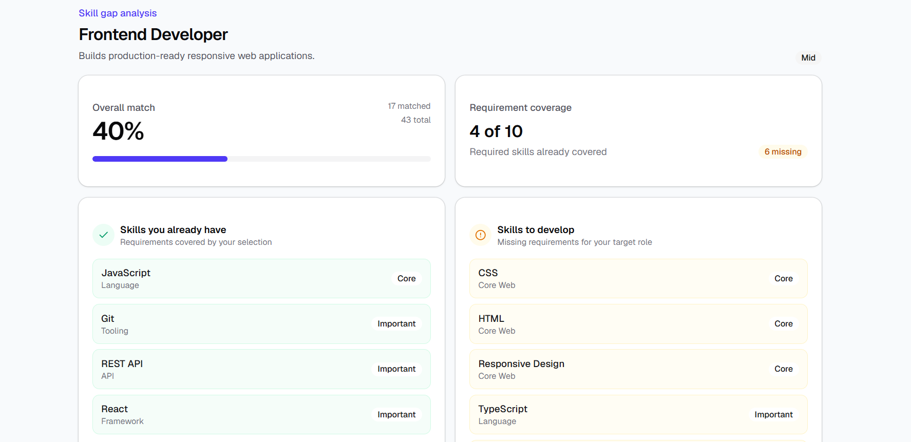
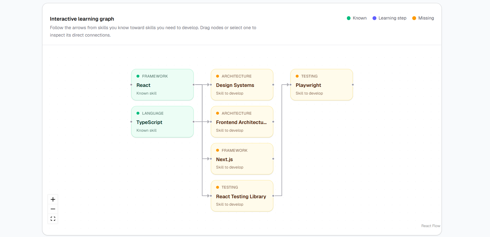

# SkillGraph — Frontend Career Path Explorer

SkillGraph is a graph-powered frontend career exploration application built with **Next.js**, **CognoDB**, and the official **Neo4j JavaScript driver**.

Users select the frontend skills they already know and a target role. SkillGraph then:

- calculates a weighted role-match percentage,
- shows matched and missing role requirements,
- finds prerequisite-based learning paths using graph traversal,
- visualizes those paths as an interactive graph.

## Demo

- **Live application:** `https://sm-skillgraph.vercel.app`
- **Repository:** `https://github.com/smishra11/skillgraph`

---

## Use Case

Frontend engineers often know a set of technologies but do not have a clear picture of how those skills relate to the requirements of a target role.

SkillGraph models frontend skills, career roles, prerequisites, and related technologies as a graph. Instead of presenting a flat checklist, the application can answer questions such as:

- How well do my current skills match a Senior Frontend Engineer role?
- Which required skills am I missing?
- Which missing skills are most important for the role?
- What prerequisite path connects something I already know to something I need to learn?
- Which technologies are connected through multiple prerequisite steps?

The result is a more useful career-planning experience than a static skills matrix.

---

## Why a Graph Database?

The interesting part of this problem is not only the individual skills or roles — it is the **relationships between them**.

A relational database could store skills and roles using join tables, but multi-step questions quickly become more awkward. For example:

> Starting from the skills a developer already knows, find prerequisite paths of up to four hops that lead to skills required by a selected role.

In a graph database, this relationship is represented directly:

```cypher
MATCH path =
  (knownSkill:Skill)-[:PREREQUISITE_OF*1..4]->(missingSkill:Skill)
```

This makes graph traversal concise and maps naturally to the domain.

SkillGraph benefits from a graph database because it needs to work with:

- role-to-skill requirements,
- skill-to-skill prerequisites,
- related technologies,
- multi-hop learning paths,
- connected knowledge rather than isolated rows.

---

## Technology Stack

- **Next.js** — App Router and API routes
- **React**
- **TypeScript**
- **Tailwind CSS**
- **shadcn/ui** with Base UI / Nova
- **CognoDB Cloud** — managed graph database
- **Neo4j JavaScript Driver** — Bolt/openCypher database connection
- **React Flow (`@xyflow/react`)** — interactive learning-path visualization
- **tsx** — TypeScript seed/verification scripts

---

## Graph Data Model

SkillGraph currently contains two node types and three relationship types.

### Nodes

#### `Skill`

```text
Skill
├── id
├── name
├── slug
├── category
├── level
└── description
```

#### `Role`

```text
Role
├── id
├── name
├── slug
├── level
└── description
```

### Relationships

#### `REQUIRES`

```text
(Role)-[:REQUIRES { importance: 1..5 }]->(Skill)
```

Represents a skill required for a role. `importance` is used when calculating the weighted match percentage.

#### `PREREQUISITE_OF`

```text
(Skill)-[:PREREQUISITE_OF]->(Skill)
```

Represents a directed learning dependency.

Example:

```text
JavaScript → React → React Testing Library → Playwright
```

#### `RELATED_TO`

```text
(Skill)-[:RELATED_TO]->(Skill)
```

Represents technologies that are closely related but do not necessarily have a strict prerequisite relationship.

### Diagram



A concrete example:



---

## Seed Dataset

The seed script loads realistic frontend-engineering data into CognoDB.

Current dataset:

| Type                            | Count |
| ------------------------------- | ----: |
| Skill nodes                     |    42 |
| Role nodes                      |    10 |
| `REQUIRES` relationships        |   102 |
| `PREREQUISITE_OF` relationships |    27 |
| `RELATED_TO` relationships      |    20 |

The ten roles are:

1. Junior Frontend Developer
2. Frontend Developer
3. React Developer
4. Next.js Developer
5. UI Engineer
6. Senior Frontend Engineer
7. Frontend Platform Engineer
8. Full Stack Developer
9. Frontend Tech Lead
10. Frontend Architect

---

## How Matching Works

Each `REQUIRES` relationship has an importance value from `1` to `5`.

The application calculates the match percentage using:

```text
matched requirement weight
-------------------------- × 100
total requirement weight
```

Example:

```text
Matched weight = 14
Total weight   = 53

Match = 14 / 53 × 100 ≈ 26%
```

This means matching a core requirement contributes more than matching a lower-priority requirement.

---

## Main Graph Queries

All application queries use **parameters** through the official Neo4j driver. User input is never concatenated into Cypher strings.

### 1. Load Roles

```cypher
MATCH (role:Role)
RETURN
  role.id AS id,
  role.name AS name,
  role.slug AS slug,
  role.level AS level,
  role.description AS description
ORDER BY role.name
```

Used to populate the target-role selector.

### 2. Load Skills

```cypher
MATCH (skill:Skill)
RETURN
  skill.id AS id,
  skill.name AS name,
  skill.slug AS slug,
  skill.category AS category,
  skill.level AS level,
  skill.description AS description
ORDER BY skill.category, skill.name
```

Used to populate the searchable current-skills selector.

### 3. Role Requirements

```cypher
MATCH (role:Role {slug: $roleSlug})
      -[requirement:REQUIRES]->
      (skill:Skill)
RETURN
  skill,
  requirement.importance AS importance
ORDER BY requirement.importance DESC, skill.name
```

Returns the skills required for a selected role together with their importance.

### 4. Weighted Skill-Gap Analysis

```cypher
MATCH (role:Role {slug: $roleSlug})
MATCH (role)-[requirement:REQUIRES]->(skill:Skill)
WITH
  role,
  skill,
  requirement,
  skill.slug IN $selectedSkillSlugs AS isMatched
RETURN
  role,
  skill,
  requirement.importance AS importance,
  isMatched
ORDER BY requirement.importance DESC, skill.name
```

The application separates the returned requirements into matched and missing skills and calculates the weighted percentage.

### 5. Multi-Hop Learning-Path Traversal

```cypher
MATCH (role:Role {slug: $roleSlug})
      -[:REQUIRES]->
      (missingSkill:Skill)
WHERE NOT missingSkill.slug IN $selectedSkillSlugs

MATCH path =
  (knownSkill:Skill)
  -[:PREREQUISITE_OF*1..4]->
  (missingSkill)
WHERE knownSkill.slug IN $selectedSkillSlugs

RETURN
  knownSkill,
  missingSkill,
  length(path) AS hops,
  nodes(path) AS path
ORDER BY hops ASC
```

This is the core graph traversal in SkillGraph.

It searches from skills the user already knows to skills required by the selected role through up to four prerequisite relationships.

The application then keeps the shortest useful path for each missing target skill before visualizing the result.

### Why this query is awkward in a relational database

With a relational schema, skill prerequisites would normally be stored in a self-referencing join table. Traversing an unknown chain of prerequisite relationships would require recursive SQL/CTEs and additional joins to reconnect the result to role requirements.

With Cypher, the same intent is expressed directly with:

```cypher
[:PREREQUISITE_OF*1..4]
```

This is the clearest example of where the graph model earns its place in this application.

---

## Application Flow

```text
Select current skills
        +
Select target role
        ↓
Analyze skill gap
        ↓
POST /api/analyze
        +
POST /api/learning-paths
        ↓
Weighted match percentage
Matched skills
Missing skills
Learning paths
        ↓
Interactive graph visualization
```

The learning graph supports:

- dragging nodes,
- zooming,
- panning,
- fit-to-view controls,
- clicking a skill to inspect its details,
- highlighting directly connected nodes and edges.

---

## API Routes

| Route                            | Method | Purpose                               |
| -------------------------------- | ------ | ------------------------------------- |
| `/api/health`                    | GET    | Verify CognoDB connectivity           |
| `/api/roles`                     | GET    | Load career roles                     |
| `/api/skills`                    | GET    | Load available skills                 |
| `/api/roles/[slug]/requirements` | GET    | Load requirements for one role        |
| `/api/analyze`                   | POST   | Calculate weighted skill-gap analysis |
| `/api/learning-paths`            | POST   | Find graph-derived prerequisite paths |

Database failures are handled gracefully. The API logs the underlying server error but returns a safe `503 Service Unavailable` response to the client.

---

## Project Structure

```text
app/
├── api/
│   ├── analyze/
│   ├── health/
│   ├── learning-paths/
│   ├── roles/
│   └── skills/
├── globals.css
├── layout.tsx
└── page.tsx

components/
├── graph/
│   ├── skill-graph.tsx
│   └── skill-node.tsx
├── ui/
├── analysis-form.tsx
├── analysis-results.tsx
├── role-selector.tsx
├── skill-selector.tsx
└── skillgraph-analyzer.tsx

lib/
└── db/
    ├── driver.ts
    └── queries.ts

scripts/
├── seed.ts
├── verify-seed.ts
└── verify-traversal.ts

seed-data.ts
.env.example
```

The project deliberately keeps the architecture small. Next.js API routes provide the server boundary, `lib/db` contains database access/query logic, and UI components remain focused on presentation and interaction.

---

## CognoDB Setup

### 1. Create a CognoDB account

Create an account in CognoDB Cloud.

### 2. Create a free instance

Create a free `c0` instance and select a region.

CognoDB provides a Bolt connection URI similar to:

```text
bolt+s://<instance-id>.databases.cognodb.cloud
```

The default username is:

```text
cognodb
```

Save the generated password when the instance is created.

### 3. Configure environment variables

Copy the example environment file:

```bash
cp .env.example .env.local
```

On Windows PowerShell, you can create `.env.local` manually instead.

Set:

```env
COGNODB_URI=bolt+s://<instance-id>.databases.cognodb.cloud
COGNODB_USERNAME=cognodb
COGNODB_PASSWORD=<your-password>
```

Do not commit `.env.local` or real credentials.

---

## Local Development

### Prerequisites

- Node.js
- npm
- CognoDB Cloud instance

### 1. Clone the repository

```bash
git clone <repository-url>
cd <repository-folder>
```

### 2. Install dependencies

```bash
npm install
```

### 3. Configure CognoDB

Create `.env.local` using the values described above.

### 4. Seed the graph

```bash
npm run seed
```

The seed script:

- creates uniqueness constraints,
- loads Skill nodes,
- loads Role nodes,
- creates `REQUIRES` relationships,
- creates `PREREQUISITE_OF` relationships,
- creates `RELATED_TO` relationships.

`MERGE` is used so the seed operation can be run safely without intentionally creating duplicate graph entities.

### 5. Verify the seed

```bash
npm run verify-seed
```

Expected counts:

```text
skills:        42
roles:         10
requires:      102
prerequisites: 27
related:       20
```

If the traversal verification script is present, run:

```bash
npm run verify-traversal
```

### 6. Start the application

```bash
npm run dev
```

Open:

```text
http://localhost:3000
```

### 7. Verify database connectivity

Open:

```text
http://localhost:3000/api/health
```

A working connection returns a successful JSON response.

---

## Production Verification

Before deployment:

```bash
npm run lint
npm run build
npm run verify-seed
```

Then perform an end-to-end test using, for example:

```text
Current skills:
- JavaScript
- React
- Git

Target role:
- Senior Frontend Engineer
```

Verify that:

- roles and skills load,
- analysis completes,
- weighted match percentage is displayed,
- matched and missing skills are displayed,
- the learning graph renders,
- graph pan/zoom/drag interactions work,
- selected-node details work,
- stale results disappear when selections change,
- loading, empty, and error states display correctly.

---

## Error Handling

SkillGraph handles database failures at both API and UI levels.

When CognoDB is unavailable:

- server-side errors are logged for debugging,
- raw Neo4j/CognoDB errors are not returned to the browser,
- database-backed endpoints return a safe `503` response,
- the UI displays a non-technical error message,
- the initial-data error state provides a retry action,
- a learning-graph failure does not discard an otherwise successful skill-gap analysis.

---

## Security

- Database URI and password are read from environment variables.
- Secrets are never hard-coded into application source files.
- `.env.local` should never be committed.
- Cypher queries use parameters rather than string concatenation.
- Database errors are logged server-side while the client receives safe error messages.

Example parameterized query:

```ts
await driver.executeQuery(`MATCH (role:Role {slug: $roleSlug}) RETURN role`, {
  roleSlug,
});
```

---

## Screenshots

Add final production screenshots before submission.

### Main Explorer



Recommended path:

```text
./docs/skillgraph-home.png
```

### Skill-Gap Results



Recommended path:

```text
./docs/skillgraph-results.png
```

### Interactive Learning Graph



Recommended path:

```text
./docs/skillgraph-graph.png
```

---

## Deployment

The application can be deployed to Vercel or another Node.js-compatible hosting provider.

For Vercel:

1. Import the GitHub repository.
2. Add these environment variables to the project:

```text
COGNODB_URI
COGNODB_USERNAME
COGNODB_PASSWORD
```

3. Deploy the application.
4. Verify `/api/health` in production.
5. Run a complete skill-gap analysis against the live CognoDB instance.
6. Keep the CognoDB instance running while the submission is being reviewed.

---

## Suggested Demo Flow

A simple end-to-end demonstration:

1. Open SkillGraph.
2. Select `JavaScript`, `React`, and `Git` as known skills.
3. Select `Senior Frontend Engineer` as the target role.
4. Click **Analyze skill gap**.
5. Explain the weighted match percentage.
6. Show matched and missing requirements.
7. Scroll to the interactive learning graph.
8. Explain that graph nodes and edges come from a multi-hop CognoDB traversal.
9. Drag/zoom the graph and click a node to inspect it.
10. Briefly show the graph schema and parameterized Cypher in the repository.

---

## Key Engineering Decisions

### Why no `User` node?

The selected skills are request-time input rather than persisted account data. Keeping them transient avoids unnecessary authentication and persistence complexity for this assignment.

### Why Next.js API routes instead of a separate backend?

The application is small enough that Next.js API routes provide a clear server boundary without introducing a second application or deployment.

### Why React Flow?

React Flow provides the interaction primitives needed for an explorable graph — node dragging, pan/zoom, fit-view controls, and custom nodes — while the actual graph data continues to come from CognoDB.

### Why shortest-path cleanup in application code?

Cypher is responsible for finding valid graph paths. The application layer then chooses the shortest useful path per missing target skill before visualization. This keeps the traversal query understandable while preventing a noisy graph UI.

---

## Limitations / Future Improvements

The assignment intentionally focuses on a small, explainable implementation. Possible future improvements include:

- persisted user profiles,
- customizable role requirements,
- richer role recommendations,
- larger datasets,
- additional graph relationships,
- automatic graph layout for significantly larger graphs,
- historical progress tracking.

These are intentionally outside the current assignment scope.

---

## Author

**Subhasish Mishra**
