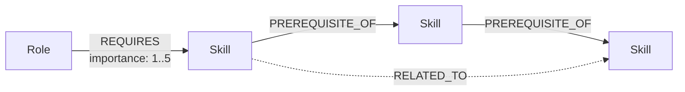
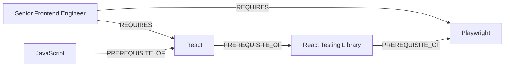
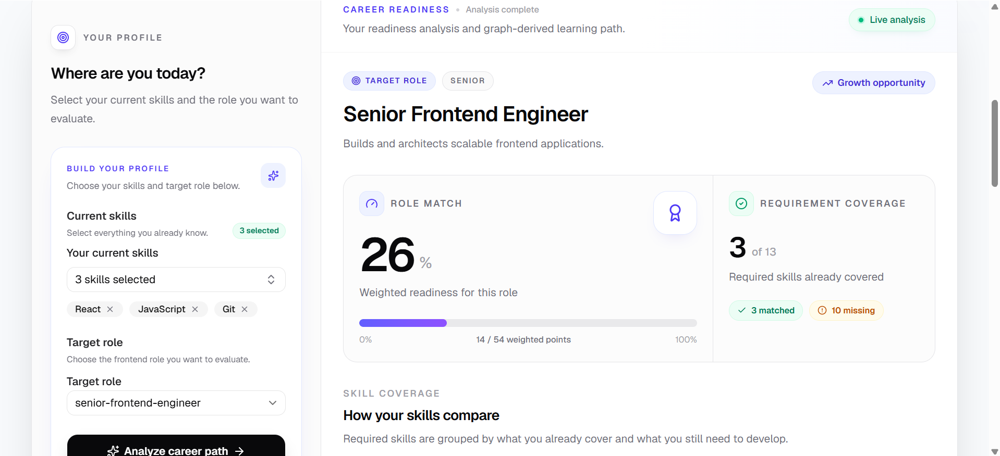
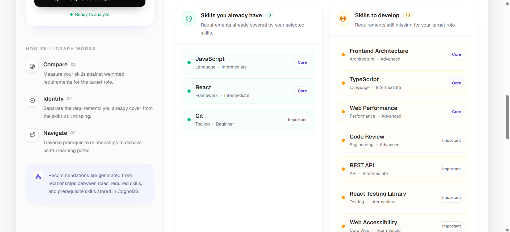
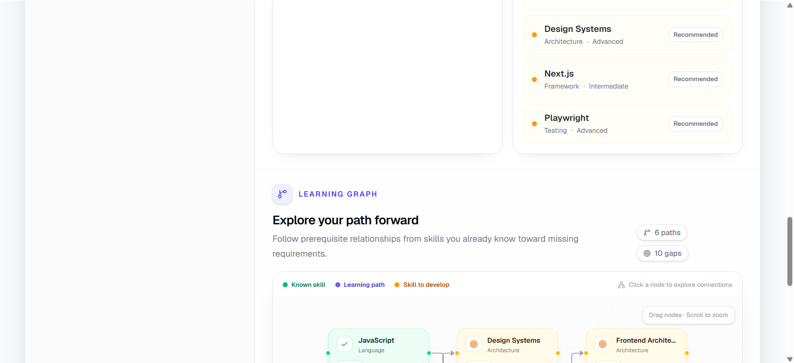

# SkillGraph — Frontend Career Path Explorer

SkillGraph is a graph-powered frontend career exploration application I built with **Next.js**, **CognoDB**, and the official **Neo4j JavaScript driver**.

The idea is simple: a developer selects the frontend skills they already know and chooses a target role. SkillGraph then calculates a weighted role-match percentage, identifies matched and missing requirements, finds prerequisite-based learning paths, and visualizes those paths as an interactive graph.

## Demo

- **Live application:** `https://sm-skillgraph.vercel.app`
- **Repository:** `https://github.com/smishra11/skillgraph`

---

## Use Case

Frontend engineers often know a number of technologies but do not always have a clear view of how those skills map to the requirements of a role they want to move into.

I built SkillGraph around that problem.

Instead of presenting a flat checklist, the application models frontend skills, career roles, prerequisites, and related technologies as connected graph data. This lets the application answer questions such as:

- How well do my current skills match a Senior Frontend Engineer role?
- Which required skills am I missing?
- Which missing skills are most important for that role?
- Is there a prerequisite path from something I already know to something I need to learn?
- Which technologies are connected through multiple prerequisite steps?

The goal is to make the output useful for career planning rather than simply showing a list of technologies.

---

## Why a Graph Database?

The most important part of this use case is not the individual skills or roles. It is the **relationships between them**.

A relational database could store the same information using tables and joins, but the learning-path part of the application becomes less natural when the number of prerequisite levels is not fixed.

For example, one of the questions SkillGraph needs to answer is:

> Starting from skills the developer already knows, find prerequisite paths of up to four hops that lead to skills required by the selected role.

With the graph model, that relationship can be expressed directly in Cypher:

```cypher
MATCH path =
  (knownSkill:Skill)-[:PREREQUISITE_OF*1..4]->(missingSkill:Skill)
```

This is one of the main reasons I chose a graph database for this project. The application works with:

- role-to-skill requirements,
- skill-to-skill prerequisites,
- related technologies,
- variable-length learning paths,
- connected knowledge rather than isolated records.

The graph is therefore part of the application logic, not just a different way of storing the same data.

---

## Technology Stack

- **Next.js** — App Router, React UI, and API routes
- **React**
- **TypeScript**
- **Tailwind CSS**
- **shadcn/ui** with Base UI / Nova
- **CognoDB Cloud** — managed graph database
- **Neo4j JavaScript Driver** — Bolt/openCypher connection to CognoDB
- **React Flow (`@xyflow/react`)** — interactive learning-path visualization
- **tsx** — TypeScript seed and verification scripts

---

## Graph Data Model

I kept the graph model intentionally small so the relationships remain easy to understand.

SkillGraph has two node labels and three relationship types.

### Nodes

#### `Skill`

```text
Skill
├── id
├── name
├── slug
├── category
├── level
└── description
```

#### `Role`

```text
Role
├── id
├── name
├── slug
├── level
└── description
```

### Relationships

#### `REQUIRES`

```text
(Role)-[:REQUIRES { importance: 1..5 }]->(Skill)
```

A `REQUIRES` relationship represents a skill needed for a role. The `importance` property is used in the weighted match calculation, so core requirements contribute more than lower-priority requirements.

#### `PREREQUISITE_OF`

```text
(Skill)-[:PREREQUISITE_OF]->(Skill)
```

This represents a directed learning dependency.

For example:

```text
JavaScript → React → React Testing Library → Playwright
```

#### `RELATED_TO`

```text
(Skill)-[:RELATED_TO]->(Skill)
```

This represents technologies that are closely related but do not necessarily have a strict prerequisite relationship.

### Diagram



A concrete example from the domain:



---

## Seed Dataset

I created a seed dataset large enough to demonstrate realistic role matching and multi-hop traversal without making the project unnecessarily large.

Current dataset:

| Type                            | Count |
| ------------------------------- | ----: |
| Skill nodes                     |    42 |
| Role nodes                      |    10 |
| `REQUIRES` relationships        |   102 |
| `PREREQUISITE_OF` relationships |    27 |
| `RELATED_TO` relationships      |    20 |

The roles included in the dataset are:

1. Junior Frontend Developer
2. Frontend Developer
3. React Developer
4. Next.js Developer
5. UI Engineer
6. Senior Frontend Engineer
7. Frontend Platform Engineer
8. Full Stack Developer
9. Frontend Tech Lead
10. Frontend Architect

The seed script uses `MERGE`, so it can be run again without intentionally creating duplicate graph entities.

---

## How Matching Works

Each `REQUIRES` relationship has an importance value between `1` and `5`.

Rather than treating every requirement equally, SkillGraph calculates the role match using the weight of the requirements the user already covers:

```text
matched requirement weight
-------------------------- × 100
total requirement weight
```

For example:

```text
Matched weight = 14
Total weight   = 53
Match = 14 / 53 × 100 ≈ 26%
```

This means matching a core requirement has a larger effect on the final score than matching a lower-priority requirement.

---

## Main Graph Queries

All application queries are parameterized through the official Neo4j driver. I do not concatenate user input into Cypher strings.

### 1. Load Roles

```cypher
MATCH (role:Role)
RETURN
  role.id AS id,
  role.name AS name,
  role.slug AS slug,
  role.level AS level,
  role.description AS description
ORDER BY role.name
```

This query populates the target-role selector.

### 2. Load Skills

```cypher
MATCH (skill:Skill)
RETURN
  skill.id AS id,
  skill.name AS name,
  skill.slug AS slug,
  skill.category AS category,
  skill.level AS level,
  skill.description AS description
ORDER BY skill.category, skill.name
```

This query populates the searchable current-skills selector.

### 3. Role Requirements

```cypher
MATCH (role:Role {slug: $roleSlug})
      -[requirement:REQUIRES]->
      (skill:Skill)
RETURN
  skill,
  requirement.importance AS importance
ORDER BY requirement.importance DESC, skill.name
```

This returns the skills required for the selected role together with the importance of each requirement.

### 4. Weighted Skill-Gap Analysis

```cypher
MATCH (role:Role {slug: $roleSlug})
MATCH (role)-[requirement:REQUIRES]->(skill:Skill)
WITH
  role,
  skill,
  requirement,
  skill.slug IN $selectedSkillSlugs AS isMatched
RETURN
  role,
  skill,
  requirement.importance AS importance,
  isMatched
ORDER BY requirement.importance DESC, skill.name
```

The application separates the returned requirements into matched and missing skills, sums their weights, and calculates the match percentage.

### 5. Multi-Hop Learning-Path Traversal

```cypher
MATCH (role:Role {slug: $roleSlug})
      -[:REQUIRES]->
      (missingSkill:Skill)
WHERE NOT missingSkill.slug IN $selectedSkillSlugs

MATCH path =
  (knownSkill:Skill)
  -[:PREREQUISITE_OF*1..4]->
  (missingSkill)

WHERE knownSkill.slug IN $selectedSkillSlugs

RETURN
  knownSkill,
  missingSkill,
  length(path) AS hops,
  nodes(path) AS path
ORDER BY hops ASC
```

This is the main graph traversal in SkillGraph.

It starts from skills the user already knows and searches up to four `PREREQUISITE_OF` relationships for missing skills required by the selected role. After receiving the paths, the application keeps the shortest useful path for each missing target before sending the result to the visualization.

### Why this query is awkward in a relational database

In a relational schema, skill prerequisites would normally be stored in a self-referencing table. Following an unknown number of prerequisite levels would typically require recursive SQL/CTEs, followed by additional joins to reconnect those results to the selected role.

Cypher expresses the traversal directly:

```cypher
[:PREREQUISITE_OF*1..4]
```

This is the clearest place in the project where the graph model adds practical value.

---

## Application Flow

```text
Select current skills
        +
Select target role
        ↓
Analyze career path
        ↓
POST /api/analyze
        +
POST /api/learning-paths
        ↓
Weighted match percentage
Matched skills
Missing skills
Learning paths
        ↓
Interactive graph visualization
```

The learning graph supports:

- dragging nodes,
- zooming,
- panning,
- fit-to-view controls,
- selecting a skill to inspect it,
- highlighting directly connected nodes and edges.

---

## API Routes

| Route                            | Method | Purpose                               |
| -------------------------------- | ------ | ------------------------------------- |
| `/api/health`                    | GET    | Verify CognoDB connectivity           |
| `/api/roles`                     | GET    | Load career roles                     |
| `/api/skills`                    | GET    | Load available skills                 |
| `/api/roles/[slug]/requirements` | GET    | Load requirements for one role        |
| `/api/analyze`                   | POST   | Calculate weighted skill-gap analysis |
| `/api/learning-paths`            | POST   | Find graph-derived prerequisite paths |

I handle database failures at the API boundary. The underlying error is logged on the server, while the browser receives a safe `503 Service Unavailable` response instead of raw Neo4j/CognoDB details.

---

## Project Structure

```text
app/
├── api/
│   ├── analyze/route.ts
│   ├── health/route.ts
│   ├── learning-paths/route.ts
│   ├── roles/route.ts
│   ├── roles/[slug]/requirements/route.ts
│   └── skills/route.ts
├── globals.css
├── layout.tsx
└── page.tsx

components/
├── graph/
│   ├── skill-graph.tsx
│   └── skill-node.tsx
├── ui/
├── analysis-form.tsx
├── analysis-results.tsx
├── role-selector.tsx
├── skill-selector.tsx
└── skillgraph-analyzer.tsx

lib/
├── db/
│   ├── driver.ts
│   ├── queries.ts
│   └── seed-data.ts
└── utils.ts

scripts/
├── seed.ts
├── verify-seed.ts
└── verify-traversal.ts

docs/
public/
```

I deliberately kept the architecture small. Next.js API routes provide the server boundary, `lib/db` contains the CognoDB connection, queries, and seed data, and the components folder contains the application UI and graph visualization.

---

## CognoDB Setup

### Create the database

This project uses a CognoDB Cloud instance. I used a free `c0` instance with the default `cognodb` username.

A CognoDB Bolt URI follows this format:

```text
bolt+s://<instance-id>.databases.cognodb.cloud
```

### Environment variables

Create `.env.local` from `.env.example` and provide the instance credentials:

```env
COGNODB_URI=bolt+s://<instance-id>.databases.cognodb.cloud
COGNODB_USERNAME=cognodb
COGNODB_PASSWORD=<your-password>
```

The real `.env.local` file is intentionally excluded from source control.

---

## Local Development

### Prerequisites

- Node.js
- npm
- a running CognoDB Cloud instance

### Clone and install

```bash
git clone https://github.com/smishra11/skillgraph.git
cd skillgraph
npm install
```

### Configure CognoDB

Create `.env.local` using the environment variables shown above.

### Seed the graph

```bash
npm run seed
```

The seed script creates the uniqueness constraints, loads the `Skill` and `Role` nodes, and creates the `REQUIRES`, `PREREQUISITE_OF`, and `RELATED_TO` relationships.

### Verify the dataset

```bash
npm run verify-seed
```

Expected counts:

```text
skills:        42
roles:         10
requires:      102
prerequisites: 27
related:       20
```

The traversal can also be checked with:

```bash
npm run verify-traversal
```

### Run locally

```bash
npm run dev
```

The application is then available at:

```text
http://localhost:3000
```

Database connectivity can be checked at:

```text
http://localhost:3000/api/health
```

---

## Verification

Before deploying the current version, I ran:

```bash
npm run lint
npm run build
npm run verify-seed
```

I also tested the main flow end to end with different combinations of skills and roles.

The checks included:

- roles and skills loading correctly,
- analysis completing successfully,
- weighted match percentage rendering correctly,
- matched and missing requirements rendering correctly,
- all-covered and no-match empty states,
- learning-path graph rendering,
- graph pan, zoom, drag, and node selection,
- stale results being cleared when the form changes,
- loading and error states,
- responsive behavior across mobile, tablet, and desktop widths.

---

## Error Handling

I wanted database failures to fail clearly without exposing implementation details.

When CognoDB is unavailable:

- the server logs the underlying database error,
- raw Neo4j/CognoDB errors are not returned to the browser,
- database-backed endpoints return a safe `503` response,
- the UI shows a non-technical error state,
- the initial-data state provides a retry action,
- a learning-graph failure does not discard an otherwise successful skill-gap analysis.

---

## Security

The project keeps database access on the server side.

- CognoDB URI, username, and password come from environment variables.
- Credentials are not hard-coded in application source files.
- `.env.local` is excluded from source control.
- Cypher queries use parameters rather than string concatenation.
- Database errors are logged server-side while safe messages are returned to the client.

A simple example of the parameterized query style used in the project:

```ts
await driver.executeQuery(`MATCH (role:Role {slug: $roleSlug}) RETURN role`, {
  roleSlug,
});
```

---

## Screenshots

Relevent screenshots







---

## Deployment

I deployed the application to **Vercel** and configured the CognoDB credentials through Vercel environment variables:

```text
COGNODB_URI
COGNODB_USERNAME
COGNODB_PASSWORD
```

The production application uses the same CognoDB instance as the local version. I also verified `/api/health` and ran a complete skill-gap analysis against the deployed application.

The CognoDB instance will remain available while the submission is being reviewed.

---

## Demo Walkthrough

For the recorded demo, I use a simple end-to-end flow that shows both the role-matching and graph-traversal parts of the project:

1. Open SkillGraph.
2. Select a few known skills such as `JavaScript`, `React`, and `Git`.
3. Select `Senior Frontend Engineer` as the target role.
4. Click **Analyze career path**.
5. Show the weighted match percentage and requirement coverage.
6. Show the matched and missing skills.
7. Open the interactive learning graph.
8. Explain that the graph is built from prerequisite paths returned by a multi-hop CognoDB traversal.
9. Drag or zoom the graph and select a node to show its connected skills.
10. Briefly show the graph schema and parameterized Cypher in the repository.

---

## Key Engineering Decisions

### Why I did not create a `User` node

The selected skills are request-time input rather than persisted account data. I intentionally kept them transient because authentication and user-profile persistence are not needed for the core use case.

### Why I used Next.js API routes instead of a separate backend

The application is small enough that Next.js API routes provide a clear server boundary without introducing a second server application or separate deployment.

The browser never connects directly to CognoDB. Database access stays inside server-side code.

### Why I used React Flow

CognoDB is responsible for finding the graph paths. React Flow is only the visualization layer.

It provides the interactions I needed—dragging, pan/zoom, fit-view controls, and custom nodes—without requiring me to build those behaviors from scratch.

### Why I keep the shortest path in application code

Cypher is responsible for finding valid prerequisite paths.

There can be multiple valid paths to the same missing skill, so after the query returns I keep the shortest useful path for each target. I chose to do that small cleanup in the application layer to keep the Cypher traversal easy to read and to avoid an unnecessarily noisy graph.

### Why the selected skills are not written to the database

Skill selection represents the current analysis request. Since there is no account or saved-profile feature, persisting those selections would add state that the current product does not need.

---

## Scope and Possible Extensions

I intentionally kept the assignment focused on one complete, explainable workflow rather than adding unrelated product features.

Some directions I would consider if the application were expanded further are:

- persisted user profiles,
- customizable role requirements,
- richer role recommendations,
- a larger skills and roles dataset,
- more graph relationship types,
- automatic graph layout for significantly larger result sets,
- historical progress tracking.

For the current version, I kept these outside the scope so the graph model, queries, application flow, and UI remain straightforward to understand.

---

## Author

**Subhasish Mishra**
